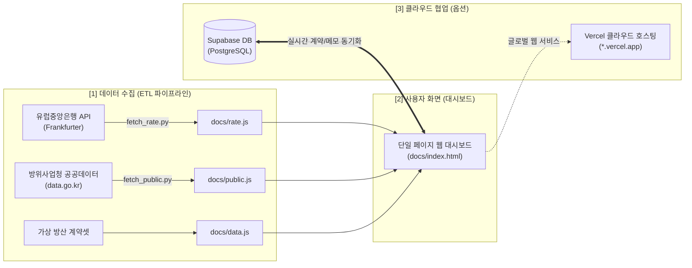

# 🛡️ 방산 구매·납기 통합 관리 대시보드
> **협력사 조달 부품의 지연과 군납 계약 일정을 직관적으로 연결하여 모니터링하고, 클라우드 DB 연동 및 주간 보고 작성을 지원하는 단일 페이지 웹 대시보드**

[](https://github.com/zedd101/openhands-defence-dashboard)
[](https://vercel.com)
[](https://supabase.com)
[](https://developer.mozilla.org)

---

## 📌 1. 프로젝트 개요 (Overview)

본 프로젝트는 방위산업 기업의 실무 팀장 및 관리자가 복잡한 협력사 조달 리스크와 군납 계약 납기를 한눈에 파악하고 신속한 의사결정을 내릴 수 있도록 설계된 **단일 페이지 반응형 웹 애플리케이션**입니다.

코딩이나 서버 설치 경험이 없는 비개발자도 **파일 더블 클릭(`file:///`)만으로 즉시 실행**할 수 있는 100% 순수 바닐라 웹 기술로 제작되었으며, 필요 시 **Supabase 클라우드 데이터베이스** 및 **Vercel 원클릭 배포**를 통해 팀원들과 실시간으로 공유하고 협업할 수 있습니다.



---

## ✨ 2. 핵심 기능 (Key Features)

### 📊 탭 1 : 방산 구매·납기 통합 관리 (샘플 대시보드)
* **핵심 KPI 요약 카드 4종 :**
  * 💰 **수주잔고 총액 :** 계약·생산·납품 단계 사업 금액 자동 집계 (기본 4,501억원)
  * 🚨 **납기 위협 [적신호] :** 부품 입고 예정일이 계약 납기 7일 전보다 늦은 위협 건수 자동 탐지
  * ⚠️ **지연 / 리스크 [황신호] :** 부품 입고 지연, 납기 지연, 수출허가 만료(D-30) 위험 사업 감지
  * 📅 **90일 내 납품 :** 기준일(2026-09-09)로부터 3개월 이내 납품 예정 계약 건수 집계
* **실시간 환율 변동 모니터링 :**
  * 유럽중앙은행(Frankfurter API) 기준 실시간 USD/KRW 환율 연동 (1 USD = 1,359.15원)
  * 해외 수출 계약(폴란드 K-계열 전차, UAE 천궁 등) 건에 대해 실시간 달러 환산 금액 병기
* **주간 보고 요약 자동 생성 및 클라우드 복사 :**
  * 현재 집계된 수치와 리스크 품목을 바탕으로 5줄 표준 임원 보고 양식 자동 작성
  * 클릭 한 번으로 클립보드 복사 (`[📋 주간 보고 요약 만들기]`)
* **3단계 상태 기반 필터링 및 조달 연계 표 :**
  * 전체 / 정상 / 지연 / 납기위협 원클릭 탭 필터링
  * 계약 클릭 시 해당 계약에 종속된 협력사 구매 발주 및 수출허가 상태를 하단에서 연계 조회

---

### 🌐 탭 2 : 공개 조달 동향 (방위사업청 공공데이터 1,870+건)
* **정부 공공데이터 실데이터 연동 :** 방위사업청 계약 체결 내역 1,870건 실시간 분석
* **육각 지표 카드 (Hexagon KPI) :**
  * 총 계약 건수 (1,870건), 총 계약 규모 (1조 1,481억원), 평균 계약액 (6.14억원)
  * 최대 계약 규모 (2,878억원), 수의계약 비중 (89.5%), 주력 조달 품목 (장비정비 775건)
* **순수 CSS/SVG 인터랙티브 차트 4종 :**
  * 📈 **월별 계약 추이 :** 월별 계약 건수 및 체결 금액 추세 차트
  * 📊 **상위 5대 조달 품목 :** 조달 분야별 규모 시각화 막대 차트
  * 🥧 **계약 체결 방식 비중 :** 수의계약, 일반경쟁, 제한경쟁 등 파이 차트
  * 🏢 **TOP 10 주요 계약 협력사 :** 주요 조달 참여 기업 순위 차트
* **고성능 대용량 데이터 원장 테이블 :**
  * 계약명, 수요기관, 계약업체 검색 및 계약방법/규모별 다중 필터
  * 1,870건에 대한 20건 단위 고속 페이지네이션 지원

---

### ☁️ 3. 백엔드 및 실시간 협업 기능 (Supabase 연동)
* **[⚙️ DB 설정] UI 기반 접속 관리 :**
  * 소스코드 수정이나 위험한 `.env` 노출 없이, 브라우저 화면에서 본인의 Supabase `Project URL`과 `Anon Public Key`를 직접 입력하여 연결
  * 접속 정보는 브라우저 `localStorage`에 암호화 보관되어 새로고침 및 Vercel 배포 후에도 안전하게 유지
* **무장애 자동 폴백 (Graceful Fallback) :**
  * DB 미연결 시 기존 가상 데이터(`data.js`)로 자동 전환되어 화면이 멈추지 않고 항상 정상 구동
* **기존 데이터 일괄 마이그레이션 (DB 업로드) :**
  * 모달 내 버튼 클릭 한 번으로 로컬 가상 데이터 12건을 Supabase `contracts` 테이블로 일괄 전송
* **[➕ 새 계약 등록] 실시간 반영 :**
  * 모달을 통해 계약명, 업체, 금액, 계약일, 계약방법을 등록하면 Supabase에 즉시 INSERT되고 대시보드 지표 및 표에 실시간 반영
* **공공데이터 실무 검토 메모 & 대응 상태 관리 (`public_notes`) :**
  * 공공데이터 1,870건 중 관심 공고에 대해 **[📝 메모]** 버튼 클릭
  * 대응 상태(`검토중`, `입찰참여`, `제안서작성`, `패스`, `낙찰성공`) 및 한 줄 메모를 Supabase에 Upsert(저장/수정)
  * 팀원들과 실시간으로 공고 대응 상태 뱃지 및 메모를 공유 (Data Enrichment)

---

## 🛠️ 4. 기술 스택 (Tech Stack)

| 구분 | 기술 / 도구 | 용도 및 특징 |
| :--- | :--- | :--- |
| **Frontend** | Pure HTML5, CSS3, Vanilla JS (ES6+) | 외부 CDN/라이브러리(Bootstrap, React 등) 0개, 로컬 오프라인 실행 보장 |
| **Backend / DB** | Supabase (PostgreSQL BaaS) | 클라우드 데이터 적재, 실시간 REST API, RLS 정책 제어 |
| **ETL Scripts** | Python 3.10+ (urllib, json) | 환율 수집(`fetch_rate.py`), 방사청 공공데이터 수집(`fetch_public.py`) |
| **Hosting** | Vercel | 정적 웹 호스팅 (`vercel.json` docs 디렉터리 서빙), 글로벌 HTTPS 자동 적용 |
| **Data Encoding** | UTF-8 (Without BOM) | 한국어 깨짐 원천 방지 |

---

## 📁 5. 프로젝트 디렉토리 구조 (Project Structure)

```text
C:\workspace\04-dashboard\
├── .git/                      # Git 형상 관리 저장소
├── docs/                      # 브라우저 실행 및 Vercel 배포 루트
│   ├── index.html             # 단일 대시보드 웹 애플리케이션 (통합 UI)
│   ├── data.js                # 방산 가상 데이터셋 (판매계약 12, 발주 14, 수출허가 7)
│   ├── rate.js                # 유럽중앙은행 실시간 환율 데이터 (USD/KRW)
│   └── public.js              # 방위사업청 계약 체결 실데이터 (1,870건)
├── fetch_rate.py              # 실시간 환율 수집 파이썬 스크립트 (Frankfurter API)
├── fetch_public.py            # 공공데이터 수집 파이썬 스크립트 (공공데이터포털 API)
├── vercel.json                # Vercel 클라우드 배포 라우팅 설정 파일
├── AGENTS.md                  # AI 에이전트 및 개발자를 위한 최상위 작업 지침
├── PRD.md                     # 제품 요구사항 정의서 및 단계별 구현 설계도
├── HANDOVER.md                # 최신 버전 기준 프로젝트 업무 인수인계서
└── README.md                  # 본 프로젝트 설명 문서
```

---

## 🚀 6. 빠른 실행 방법 (Quick Start)

### 방법 A : 로컬에서 더블 클릭 실행 (가장 간단)
1. 저장소를 클론하거나 다운로드합니다.
2. `docs/index.html` 파일을 더블 클릭하여 크롬/엣지 브라우저에서 바로 엽니다.
3. 별도의 웹 서버나 패키지 설치(`npm install` 등) 없이 모든 화면과 데이터가 즉시 구동됩니다.

### 방법 B : Vercel 웹 클라우드 배포
1. 본 저장소를 개인 GitHub 계정으로 푸시합니다.
2. [Vercel](https://vercel.com)에 로그인 후 `[Add New...]` → `[Project]`에서 저장소를 Import합니다.
3. 설정 변경 없이 `[Deploy]`를 누르면 30초 만에 `https://*.vercel.app` 주소가 생성됩니다.

---

## 🔄 7. 데이터 갱신 방법 (Data Refresh)

### 1) 환율 데이터 갱신
```bash
python fetch_rate.py
```
* 유럽중앙은행(Frankfurter API)에서 최신 환율을 수집하여 `docs/rate.js`를 자동 갱신합니다.

### 2) 방위사업청 공공데이터 갱신
```bash
# 기본 모드 (최근 데이터 수집)
python fetch_public.py

# 정밀 수집 모드 (수천 건 계약 수집)
python fetch_public.py --deep
```
* 수집된 계약 데이터는 `docs/public.js`로 생성되어 대시보드 두 번째 탭에 즉시 반영됩니다.

---

## 🔒 8. 보안 및 운영 원칙

1. **외부 CDN 링크 금지 :** 악성 스크립트 삽입 및 사내망 보안 경고를 방지하기 위해 모든 스타일과 로직은 순수 바닐라 코드로 내장되어 있습니다.
2. **무인증 접속 정보 격리 :** Supabase 접속 URL 및 API Key는 소스코드에 하드코딩되지 않고 각 사용자의 브라우저 로컬 저장소(`localStorage`)에만 독립 보관됩니다.
3. **가상 데이터 고정 안내 :** 교육 및 시뮬레이션 목적의 가상 데이터셋임을 화면 최하단 푸터에 고정 표시합니다.

---

*※ 본 대시보드의 데이터는 교육용 가상 데이터 및 공공데이터포털 공개 정보를 바탕으로 구성되었습니다.*
